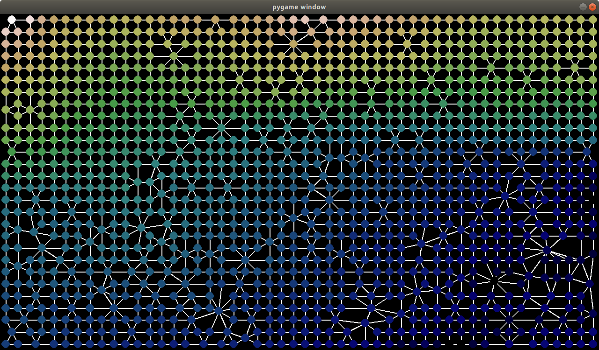

# river-flow-3
Another attempt at writing the river flow algorithm focused on visualizations

## Visualization Steps

1. Pixels with colour for height
2. Swap to graph
3. Visualise merging equal height nodes by moving them to the centre point then changing them into one point
4. Flooding
5. BFS
6. Sort
7. Creation of linked list
8. Flow simulation

### Instructions

1. Create virtual environment `virtualenv -p python3.7 venv`
1. Install required packages `pip install -r requirements.txt`
1. `cd pygame`
1. `python renderer.py`
1. Press right arrow key to advance
1. During some steps use the mouse to interact
1. Press ESC at any time to exit

### Height map image alignment (hard)

1. Download sentinel tile.
1. Download aster dem tile.
1. Load both datasets in SNAP desktop. They should have enough info to load into the world view. If they don't fix up the source data.
1. Resample the sentinel image. Raster > Geometric Operations > Resampling
1. Colocate the images. Make sure the master is the sentinel image. Don't select nearest neighbour. Bicubic interpolation worked well last time.
1. Subset the image (do this to crop the image and select only the elevation correct band).
1. Export this as a GeoTiff.
1. Go back to the sentinel tile. Create an RGB image (with sentinel RGB values) and then export view as image. This should give you accurate colours.
1. If the images don't overlap correctly you will need to subset when you export probably.

### Screenshot

### Image processing

1. Download sentinel 2 tiles. Optimise for complete tiles (no black areas), time of day (no shadows), then cloud cover. Use the EarthExplorer website.
1. Download dem files from Alaska Satellite Facility.
1. Load all files in qgis. Use the merge tool to create two large tifs of the area selected. One 1hould be the height map and one should be the true colour image.
1. Use the align raster tool to align the dem with the sentinel image. Make sure the images have the same pixel size, and same height/width afterwards. If required adjust the area bounds to make sure the height/width are correct.
